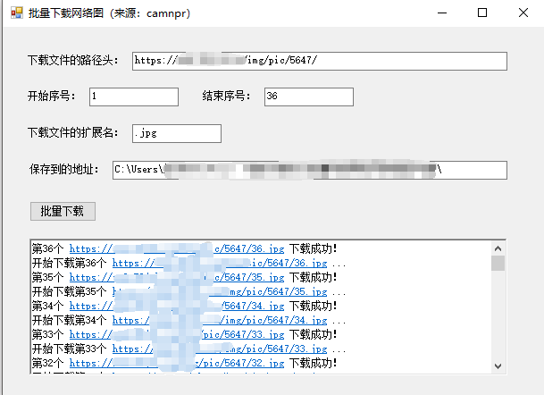


<h1 align="center">DownloadNetWorkImage</h1>

Batch download network pictures 

[![NPM version][npm-image]][npm-url] [![NPM downloads][download-image]][download-url]

[![Discussions][discussions-image]][discussions-url] [![][issues-helper-image]][issues-helper-url] [![Issues need help][help-wanted-image]][help-wanted-url]

[npm-image]: https://img.shields.io/npm/v/DownloadNetWorkImage.svg?style=flat-square
[npm-url]: http://npmjs.org/package/DownloadNetWorkImage

[download-image]: https://img.shields.io/npm/dm/DownloadNetWorkImage.svg?style=flat-square
[download-url]: https://npmjs.org/package/DownloadNetWorkImage
[help-wanted-image]: https://flat.badgen.net/github/label-issues/camnpr/DownloadNetWorkImage/help%20wanted/open
[help-wanted-url]: https://github.com/camnpr/DownloadNetWorkImage/issues?q=is%3Aopen+is%3Aissue+label%3A%22help+wanted%22
[discussions-image]: https://img.shields.io/badge/discussions-on%20github-blue?style=flat-square
[discussions-url]: https://github.com/camnpr/DownloadNetWorkImage/discussions

[issues-helper-image]: https://img.shields.io/badge/using-issues--helper-orange?style=flat-square
[issues-helper-url]: https://github.com/actions-cool/issues-helper

## ✨ Features

- 🌈 Support http/https of protocol
- 📦 

## 🎯 Environments

- .NET FrameWork 4.5 and later